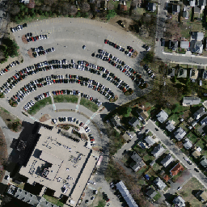
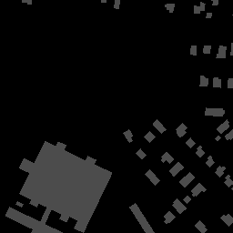

# Semantic-segmentation
一个采用**Pytorch**的语义分割项目


这个repo是在完成教研室的遥感图像语义分割项目时写的，因为数据集不是遥感项目的数据集，而是随便download的一个数据集，且还在项目初期，基本在于搭建，所以不涉及教研室资料泄密问题。




## 我的环境

- windows10
- Anaconda 3
- pytorch 1.0
- tensorflow tensorboard tensorboardX (用于可视化)

## 如何运行

### 所有的相对路径均在代码中配置

- 打开终端，输入  
```
python train_Seg.py
```  
- 调用Segnet
- 或者  
```
python train_U.py
```  
- 调用Unet
- 或者  
```
python predict.py
```  
- 进行推断inference

## 包含文件

###  [main.py](main.py)

* 空文件，为之后添加代码

###  [config.py](config.py)

* 空文件，为之后添加代码

###  [train_Seg.py](train_Seg.py)

* 调用Segnet进行训练网络
* 主函数

###  [train_Unet.py](train_Unet.py)

* 调用Unet进行训练网络
* 主函数

###  [predict.py](predict.py)

* 对模型进行inference预测

###  [models/seg_net.py](seg_net.py)

* Segnet网络定义

###  [models/u_net.py](u_net.py)

* Unet网络定义

###  [train/MIoU.py](MIoU.py)

* 计算MIoU核心代码

###  [utils/DataArgument.py](DataArgument.py)

* 计算MIoU核心代码

## 数据集  

### 数据集下载
[https://www.cs.toronto.edu/~vmnih/data/](https://www.cs.toronto.edu/~vmnih/data/)


### 数据集处理
进入vutils文件夹，使用下面语句（相对路劲要提前配置好） 


```
python DataArgument.py
```  


**DataArgument.py**实现了对大图进行切割（成256 x 256），切割后旋转，加噪声等操作来生成训练数据。


### [这个repo适合新手入门pytorch和图像分割]()


